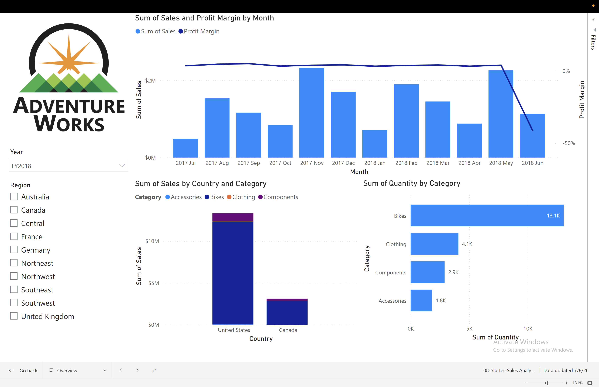
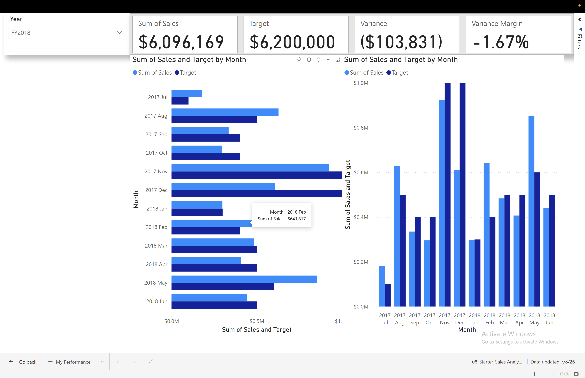
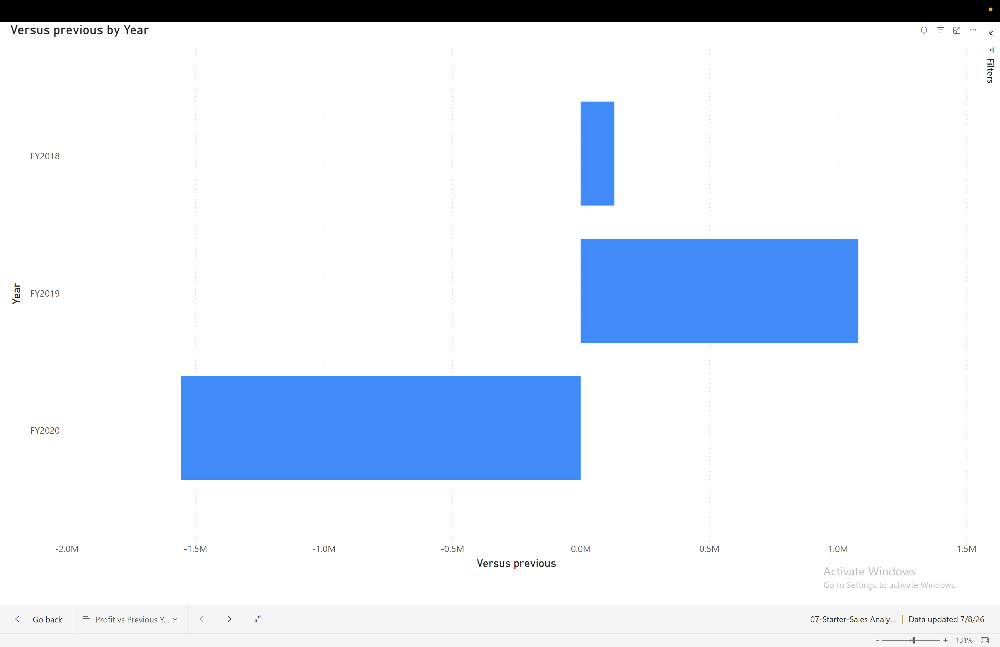
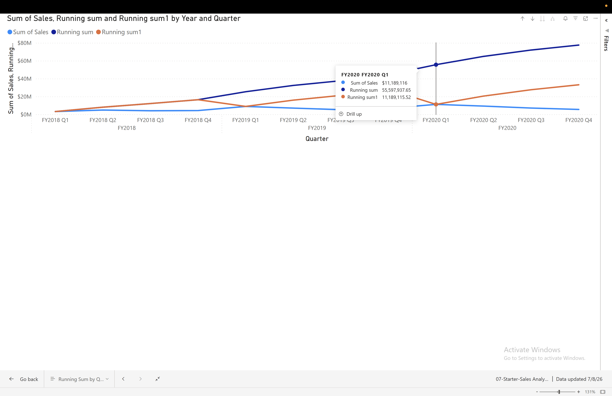
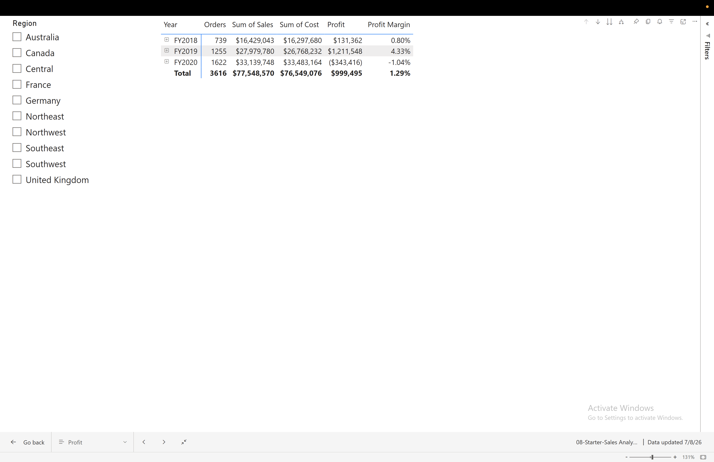

# 📊 Adventure Works Sales Dashboard (Power BI)

## Project Overview
This project was created in Microsoft Power BI using the Adventure Works sales dataset.  
The aim was to analyse sales performance, compare sales against targets, review profit trends, and present insights using interactive dashboards.

---

## 🎯 Objectives
- Analyse total sales and profit performance.
- Compare sales with targets.
- Identify variance and profit margin.
- Track sales trends by month, year and quarter.
- Create interactive reports using slicers and filters.

---

## 🛠 Tools Used
- Microsoft Power BI Desktop
- DAX
- Visual Calculations
- Slicers
- Matrix tables
- Bar charts
- Line charts
- KPI cards

---

## 📌 Key Findings
- Sales performance can be compared against targets using KPI cards and variance calculations.
- Profit changed across fiscal years, with visual calculations showing the difference from the previous year.
- Running sum helped to show cumulative sales over time.
- Interactive filters make the dashboard easier to explore by year and region.

---

## 🚀 Skills Demonstrated
- Data Analysis
- Power BI Dashboard Design
- KPI Reporting
- DAX Calculations
- Visual Calculations
- Running Sum
- Moving Average
- Sales and Profit Analysis
- Data Visualisation
- Business Reporting

---

## 📁 Project Files
- `AdventureWorks_Dashboard.pbix`
- `overview-dashboard.png`
- `sales-target-analysis.png`
- `profit-analysis.png`
- `running-sum-analysis.png`
- `matrix-report.png`

---

## 📷 Dashboard Preview

### Overview Dashboard

### Sales Target Analysis

### Profit Analysis

### Running Sum Analysis

### Matrix Report

